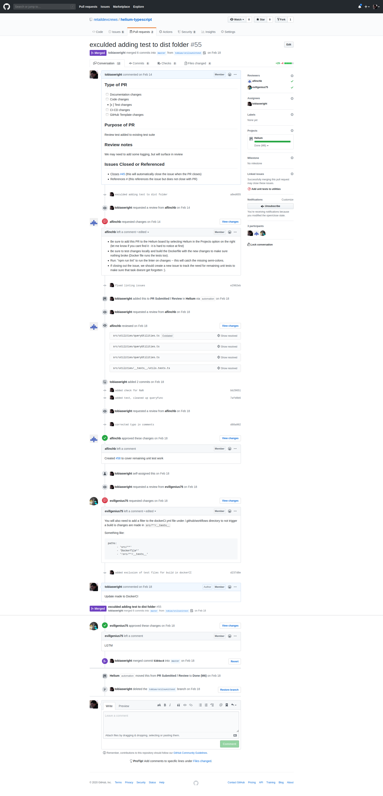

### 3.0	 Demonstrates creation or update of Continuous Integration and Delivery (CI/CD ) in Dev Crew Project

3.1 Demonstrated how to build or update CI/CD pipelines.  E.g. Azure DevOps to build, test and deploy updates to an application 

Updated docker, which is part of the CI/CD build to exlude test folder

