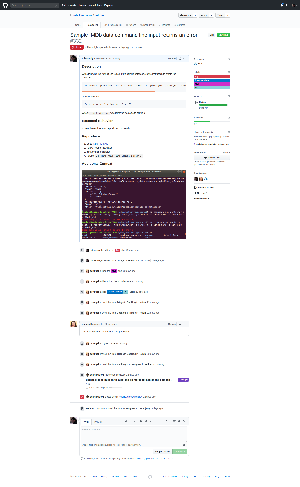
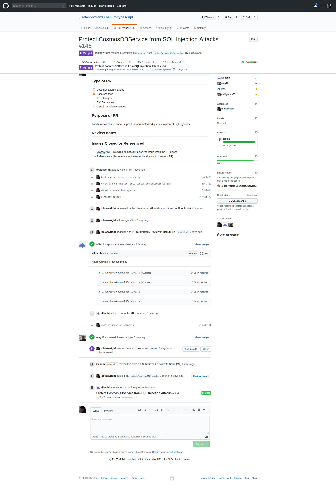

### 4.0	  Actively participate in the code review process as part of the code check-in process			

4.2 Demonstrate creation of work item for bug and linking to the "pull" request that introduced it, once the error has been diagnosed. This aids learning on application capabilities and complexities

Below you'll find a bug that was created the second screeenshot is linking a PR that to an issue (not created by me)

