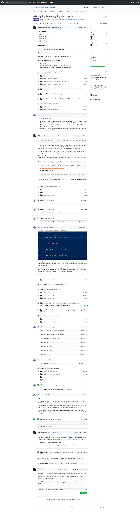

### 5.0	 Integrates observability (tracing and monitoring) into project deliverables 

5.1 Service/component request can be traced across systems to give a complete view of app behavior (Ex. Distributed tracing pattern)

Update of logging which can produce a stack trace when there is an error

