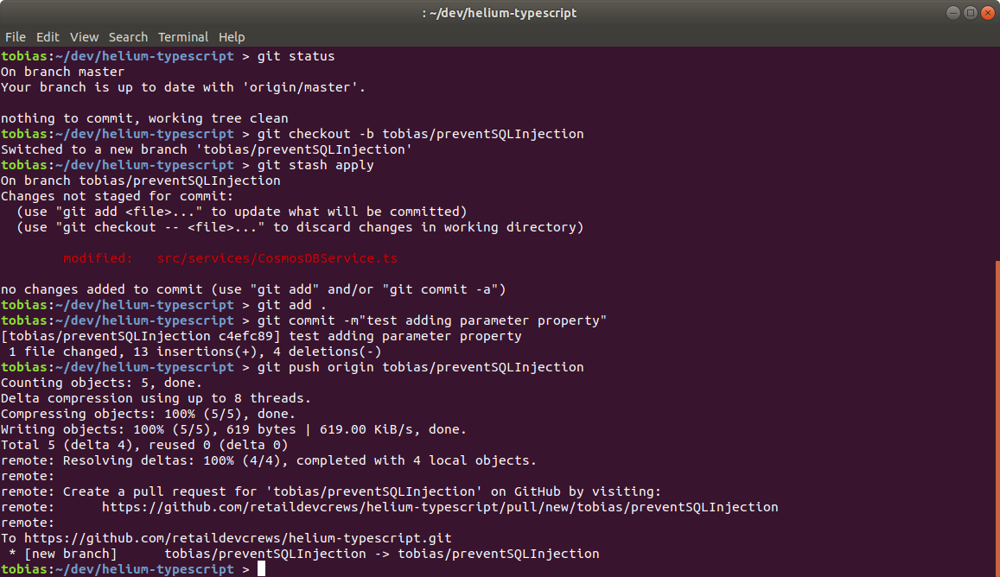
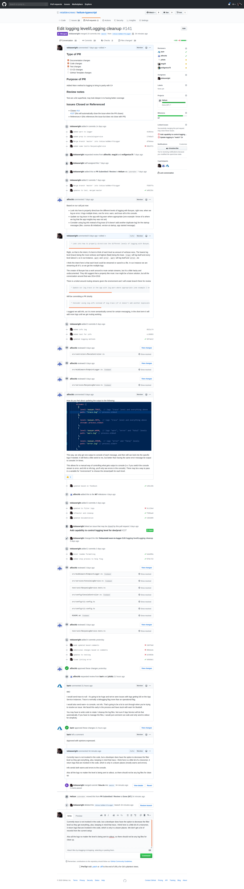

### 1.0	 Demonstrate Source Control Capability			
1.1 [Complies with branch policies as to defined by project (e.g. prevent commits directly to master branch.)](1-1.md) 

#### cli1

1.2	Merges are carried out through PRs with the correct level of code review and continuous integration.

##### PR

1.3 Clear commit history with consistent messaging on changes that is easy to follow ( why and what ) 

[Screenshot](#PR)

1.4 No Secrets are published in the repo

1.5 Clear branch naming to provide clarity on changes and ownership 

[Screenshot](#PR)

1.6 Clear documentation added and comments made to the repo to aid with code reviews and future updates 

[Screenshot](#PR)

1.7	 Has a solid understanding of GIT usage and how to participate effectively in community based Git projects. 
* [Screenshot](#PR)
* [Screenshot](#cli1)

### 2.0	 Demonstrated development of Unit Testing capabilities within the Dev Crew project 
2.1 Code written has full code coverage with clear pass and fail criteria 

2.2 Clear knowledge of specific language guidance for unit testing 

2.3 All data required for the test is clearly defined and can be localized

2.4 For complex apps that support multi-threaded patterns or state management, clear provisions are made to fully test 
	
### 3.0	 Demonstrates creation or update of Continuous Integration and Delivery (CI/CD ) in Dev Crew Project 
3.1 Demonstrated how to build or update CI/CD pipelines.  E.g. Azure DevOps to build, test and deploy updates to an application 

3.2 Demonstrated awareness of the deployment strategy/target, whether this is a standard VM, Container or Serverless infrastructure 
	
### 4.0	  Actively participate in the code review process as part of the code check-in process 
4.1 Demonstrate that all builds produced out of project repositories include appropriate linters, run unit tests, and complete without errors nor warnings.

[Screenshot](#PR)

4.2 Demonstrate creation of work item for bug and linking to the "pull" request that introduced it, once the error has been diagnosed. This aids learning on application capabilities and complexities

4.3 Team lead should jointly review code updates with the Software Engineer to provide feedback on coding style and documentation 
[Screenshot](#PR)

### 5.0	 Integrates observability (tracing and monitoring) into project deliverables 
5.1 Service/component request can be traced across systems to give a complete view of app behavior (Ex. Distributed tracing pattern) 

5.2 Implements appropriate health checks and application metrics/(alerts if applicable) that help to understand service behavior and troubleshoot problems.  Can be monitored/aggregated by appropriate ops system at scale. 

 5.3 Project deliverables related to monitoring/tracing/observability generally align to best practices for deployment target and integrate into deployment environment. 
	
### 6.0	 Demonstrates strong coding capabilities 
6.1 Software engineer can deliver high quality code into the project with limited bugs and no blockers (P0/1) issues.